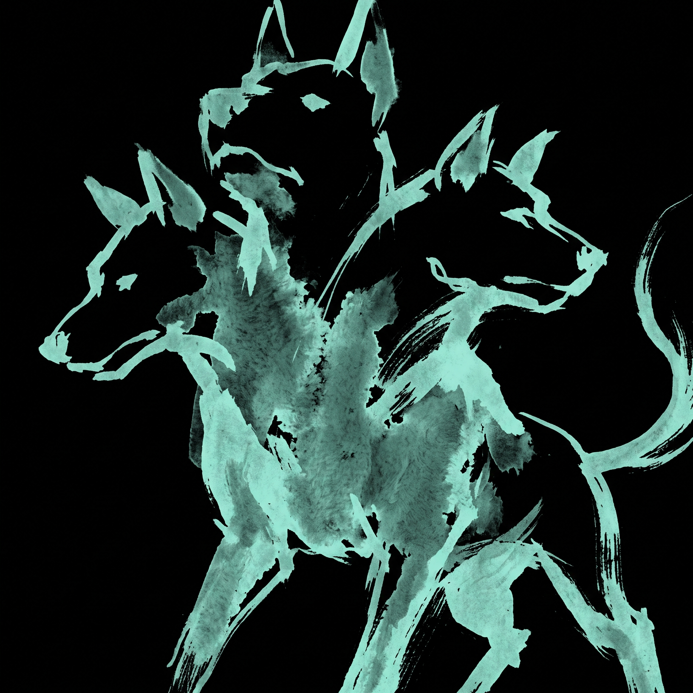

  

<h3 align="center">Hi, I'm Gustavo 👋</h3>

  Backend engineer. I build with hexagonal architecture and break things with pentesting. 
  Minimalist Linux setup (i3wm/Archcraft), terminal-first workflow.

GitHub Stats

